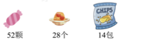

1. ☆÷△ ＝ 8……4，△ 最小是 ，这时 ☆ 是 。

【答案】5 ; 44
【解析】【分析】在有余数的除法中，余数要小于除数，除数最小比余数大1。先确
定最小的除数，然后用商乘除数再加上余数即可求出被除数。
【详解】4＋1＝5
8×5＋4
＝40＋4
＝44
☆÷△＝8……4，△最小是5，这时☆是44。

2. 小马虎在计算 35－□÷7 时弄错了计算顺序，先算减法再算除法了，结果是 3，正确得数应该
   是 。

【答案】33s
【解析】【分析】运算顺序弄错的算式是：（35－□）÷7＝3，因此根据商×乘数＝被
除数，即35－□＝3×7＝21，根据被减数－差＝减数，即□＝35－21＝14，然
后按照正确的顺序计算出正确得数即可。
【详解】35-7x3 = 14
则□为14。
35-14/7 = 33
则正确得数应该是33。

3. 有一堆桃子，3 个 3 个数还剩 2 个，7 个 7 个数也还剩 2 个，这堆桃子至少有 个。

【答案】23
【解析】【分析】如果把桃子拿出2个，那么桃子数除以3或者除以7都没有余数，此
时桃子总数最少是3和7的积，再加上2就是这堆桃子至少的个数。
【详解】3×7＋2
＝21＋2
＝23（个）
所以这堆桃子至少有23个。

4. 小芳练字，她把“我爱数学”反复写，第 34 个字是（ ）。
   A. 我 B. 爱 C. 数

【答案】B
【解析】【分析】“我爱数学”4个数字为一组循环，用34除以4求出商和余数，余数是
几就说明最后一个字与每组中第几个字相同。
【详解】34÷4＝8（组）……2（个），余数是2，说明第34个字是爱。
故答案为：B

5. 儿童节快要到了，老师要给小朋友们准备儿童节大礼包．每个大礼包中都有 6颗糖果、 3个
   果冻、 2包薯片，下图中的物品最多可以包装成几个大礼包？

   

【答案】7个
【解析】【分析】用52除以6求出商和余数，商就是糖果可以包装成礼包的个数；用
28除以3求出商和余数，商就是果冻最多可以包装成礼包的个数；用14除以2
求出商，商就是薯片可以包装成礼包的个数。比较后选择商最小的就是最多
可以包装成礼包的个数。
【详解】糖果：52÷6＝8（个）……4（颗）
果冻：28÷3＝9（个）……1（个）
薯片：14÷2＝7（个）
7＜8＜9
答：这些物品最多可以包装成7个大礼包。

6. 1, 121, 2, 61, 3, 41, (5 ), (25 ), 6, 21。

7. 把 2， 3， 4， 5， 6， 7， 8这七个数分别填入图中的圆圈中，使两个正方形中四个数之
和都等于19．

【解析】先考虑求 2个正方形公共的重叠数．(2+3+4+5+6+7+8) + 重叠
数＝ 19 X 2 = 38．重叠数为：38-35 = 3 ，那么中间圆圈里面的重叠数
应该填 3．剩下的 个数 2、4 、 5、 6、 7、8 中，三个数的和应为：19 - 3 = 16
，凑数：2+6+8=16 、4+5+7=16 ，所以每个正方
形中，剩下的三个数应该填：2 ，6 ， 8或 4， 5， 7．具体填法如下：（答案不
唯一）

8. 在小路的一旁种树，每隔5米种一棵，从小路的一头种到另一头正好种了9棵树（两头
都种），这条小路长___米．

【解析】每隔 5米种一棵树，两头都种，种了 9棵树，一共有 9-1 =8个间隔，
8 x 5 = 40（米）．
故答案为： 40．

9. 王红去文具店买小红旗，如果买一面，就剩14 元钱；如果买 2面，就差28 元钱．那么王
红带了多少元钱？

【答案】56元．
【解析】一面红旗的价格为 14+28=42（元）， 42+14=56（元）.
答：王红带了56元．