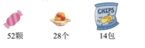
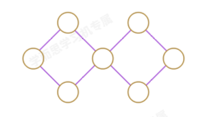

1. ☆÷△ ＝ 8……4，△ 最小是 ，这时 ☆ 是 。

2. 小马虎在计算 35－□÷7 时弄错了计算顺序，先算减法再算除法了，结果是 3，正确得数应该
   是 。

3. 有一堆桃子，3 个 3 个数还剩 2 个，7 个 7 个数也还剩 2 个，这堆桃子至少有 个。

4. 小芳练字，她把“我爱数学”反复写，第 34 个字是（ ）。
   A. 我 B. 爱 C. 数

5. 儿童节快要到了，老师要给小朋友们准备儿童节大礼包．每个大礼包中都有 6颗糖果、 3个
   果冻、 2包薯片，下图中的物品最多可以包装成几个大礼包？

   

6. 1, 121, 2, 61, 3, 41, ( ), ( ), 6, 21。

7. 把 2， 3， 4， 5， 6， 7， 8这七个数分别填入图中的圆圈中，使两个正方形中四个数之
和都等于19．

8. 在小路的一旁种树，每隔5米种一棵，从小路的一头种到另一头正好种了9棵树（两头
都种），这条小路长___米．

9. 王红去文具店买小红旗，如果买一面，就剩14 元钱；如果买 2面，就差28 元钱．那么王
红带了多少元钱？
